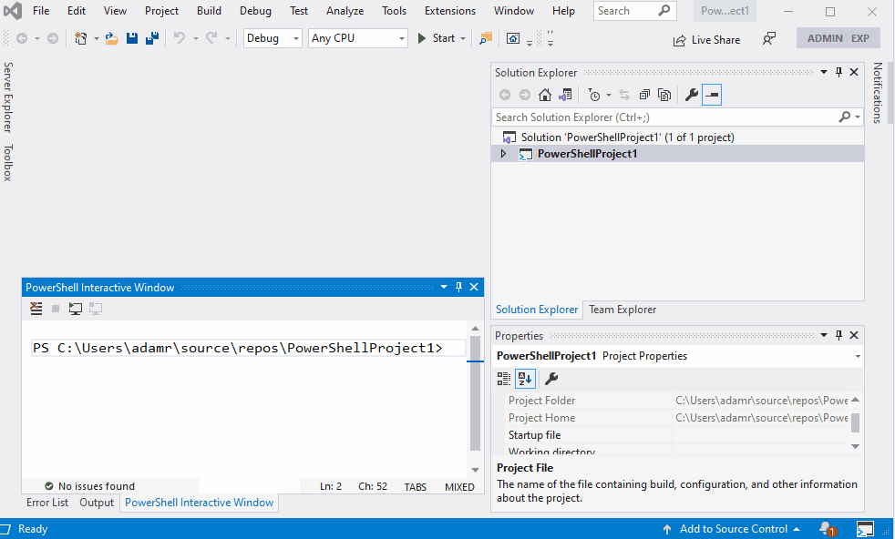
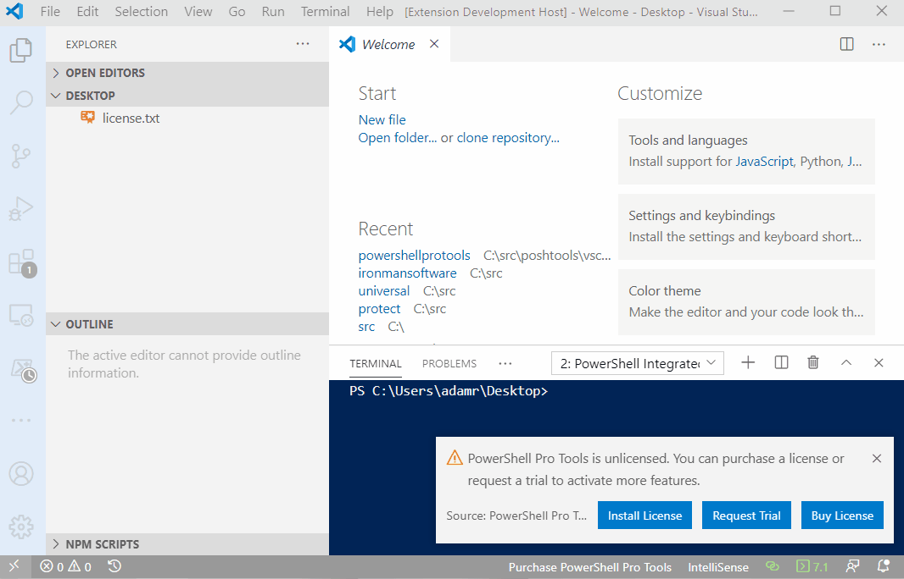
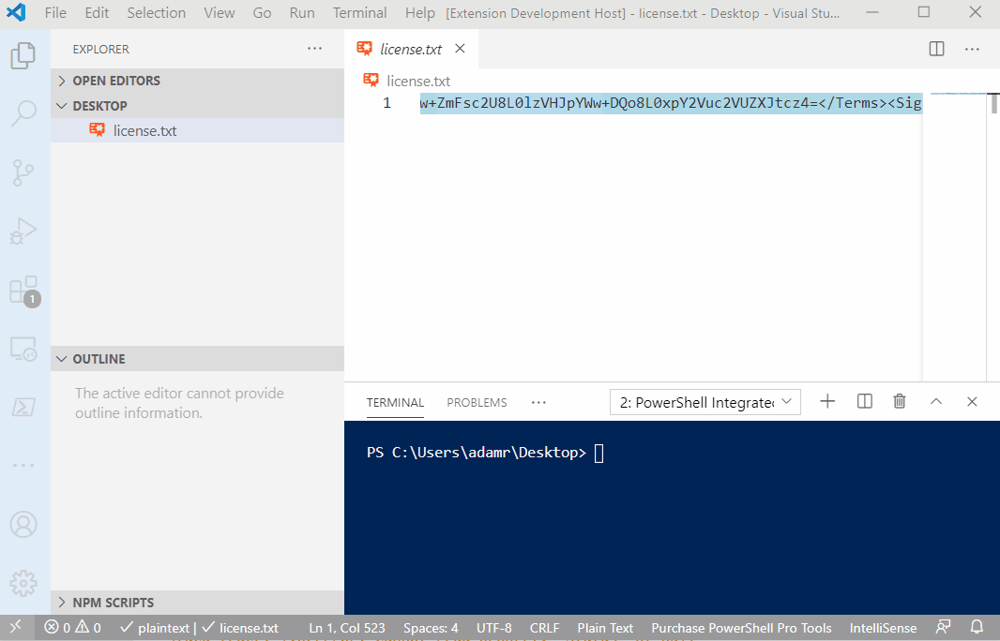

# Installation and Licensing

## Installation

**Visual Studio**

PowerShell Pro Tools is included with [PowerShell Tools for Visual Studio](https://marketplace.visualstudio.com/items?itemName=AdamRDriscoll.PowerShellToolsforVisualStudio2017-18561). You can install it through Visual Studio or download it from the Marketplace. 

For offline installation instructions, click here.

**Visual Studio Code** 

The Visual Studio Code extension is available on the [Visual Studio Marketplace](https://marketplace.visualstudio.com/items?itemName=ironmansoftware.powershellprotools) and can be installed from within Visual Studio Code. Search for PowerShell Pro Tools when searching in VSC. 

**Visual Studio Code Offline Install**

You can install a Visual Studio Code extension by downloading the VSIX file from the Marketplace and then clicking Install from VSIX within the extension pane in Visual Studio Code. 


**PowerShell Module**

The PowerShell Module is available on the [PowerShell Gallery](https://www.powershellgallery.com/packages/powershellprotools/1.3.0). 

### Installing Previous Versions

#### Visual Studio

Previous versions of the Visual Studio extension can be found on our [downloads page.](https://ironmansoftware.com/downloads)


#### Visual Studio Code

You can select from previous versions of the Visual Studio Code extension in the extension pane. Click the Gear icon next to PowerShell Pro Tools and select Install Another Version...


#### PowerShell Module

You can install a previous version of the PowerShell Module by using the `-RequiredVersion` parameter of `Install-Module`.

```text
Install-Module -Name PowerShellProTools -RequiredVersion 5.7.0
```

## Licensing

### Trial Licenses

By default, PowerShell Pro Tools installs and allows for a limited set of features. If you would like to trial PowerShell Pro Tools without these limitations, you can [request a trial key](https://ironmansoftware.com/product/powershell-pro-tools-trial/). 

### Purchasing a License

Visit the [purchasing page](https://store.ironmansoftware.com/pricing/powershell-pro-tools) and follow the instructions to purchase a license. A license will be emailed to you within ten minutes of purchase. 

### Installing a License

### Visual Studio 

You can install your license file in Visual Studio by click Help and then About PowerShell Pro Tools Licensing. This will open a dialog that will allow you to install your license. Click the Install License button and select your license file. 



#### Visual Studio Code

When the PowerShell Pro Tools extension activates, it will ask for a license key. You can click Install License to install the license key.



Use the `PowerShell Pro Tools: Install License Key` command to install your license. 

In Visual Studio Code, press `Ctrl+Shift+P` to activate the command palette. Once the palette is shown, you can start to search for the command listed above. Select it and press enter. Paste the entire contents of the license key file into the input box shown.



### PowerShell

You can use the `Install-PoshProToolsLicense` cmdlet to install your license.

```text
Install-PoshProToolsLicense -Path C:\license.txt
```

### Manual Installation

You can manually install your license by placing a `license.lic` file in your `%AppData%\PowerShell Pro Tools` directory. The directory may not exist. Place the full XML of the license file you received in this file. 

