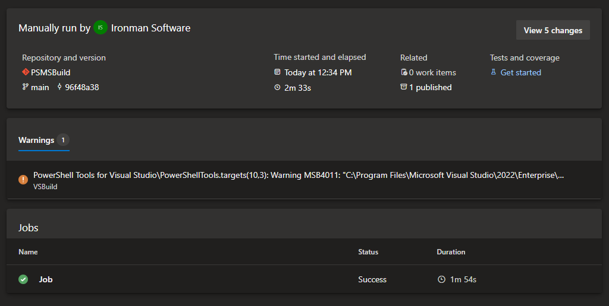

# Package.psd1


Requires [PowerShell Pro Tools](https://ironmansoftware.com/poshtools)


## About

This about file contains information about using hashtables and PSD1 files to configure Merge-Script. These psd1 files are also used by PowerShell Tools for Visual Studio Code.

### Config File Schema

```powershell
@{
        Root = 'c:\Users\Adam\Desktop\service.ps1' # Root script to package. This is the main entry point for the package. 
        OutputPath = 'c:\Users\Adam\Desktop\out' # The output directory for the packaging process. 
        Package = @{
            Enabled = $true # Whether to package as an executable. 
            Obfuscate = $false # Whether to obfuscate the resulting executable. 
            HideConsoleWindow = $false # Whether to hide the console window.  Only valid for console applications.
            # The target .NET Framework version. You will need the .NET Developer Pack for this version installed on your machine.
            # If target PowerShell 7, you can also use netcoreapp31 here 
            DotNetVersion = 'v4.6.2'
            FileVersion = '1.0.0' # The output file version
            FileDescription = '' # The output file description
            ProductName = '' # The output file product name
            ProductVersion = '' # The output file product version.
            Copyright = '' # The output file copyright
            RequireElevation = $false # Whether to require elevation when running the executable. Only valid for console applications. 
            ApplicationIconPath = '' # The path to the application icon to use for the executable. 
            PackageType = 'Console' # The type of executable to generate. Valid values are Service or Console. 
            ServiceName = "" # The name of the service if the package type is Service. 
            ServiceDisplayName = "" # The display name of the service if the package type is Service. 
            HighDPISupport = $true  # Whether to enable high DPI support for WinForm applications
            PowerShellArguments = '' # Sets the arguments for the PowerShell process that is hosted within the executable. You can use arguments like -NoExit, -ExecutionPolicy and -NoProfile.
            Platform = 'x64' # Sets the architecture of the executable. Can be either 'x86' or 'x64'
            PowerShellVersion = 'Windows PowerShell' # You can specify Windows PowerShell or PowerShell 7 or later versions version (e.g. 7.0.0)
            RuntimeIdentifier = 'win-x64' # You can specify other runtimes like linux-x64 (See .NET Core runtime identifiers)
            DisableQuickEdit = $false # Disables the quick edit mode on windows console apps
            Resources = [string[]]@() # Resources to embed in the output executable
        }
        Bundle = @{
            Enabled = $true # Whether to bundle multiple PS1s into a single PS1. Always enabled when Package is enabled. 
            Modules = $true # Whether to bundle modules into the package
        }
    }
    
```

### Using a config file

A config file can be used either from within a PowerShell script as a hashtable or imported from a PSD1 file containing the hashtable.

## Options

### Root

The root script to package.

### OutputPath

The path of the output directory for the resulting executable.

### Package

Options for the packager. See the config file schema for the proper layout.

#### Enabled

Whether the packager is enabled. Valid values are either $true or $false.

#### Obfuscate

Whether to obfuscate the assembly. Only valid for Windows PowerShell. Valid values are $true or $false.

#### HideConsoleWindow

Whether to hide the console window. Useful for when packaging form applications. Valid values are $true or $false.

#### DotNetVersion

The .NET version to target for the executable. You can find the valid values below.

| PowerShell Version | Valid .NET Versions                              |
| ------------------ | ------------------------------------------------ |
| Windows PowerShell | net4.6.2, net4.7.0, net4.7.1, net4.7.2, net4.8.0 |
| PowerShell 7.0.x   | netcoreapp31                                     |
| PowerShell 7.1.x   | net5.0                                           |
| PowerShell 7.2.x   | net6.0                                           |

#### FileVersion

The file version to display in the assembly properties.

#### FileDescription

The file description to display in the assembly properties.

#### ProductName

The product name to display in the assembly properties.

#### ProductVersion

The product version to display in the assembly properties.

#### Copyright

The copyright to display in the assembly properties.

#### RequireElevation

Whether the executable requires elevation to run. This setting is only supported on Windows. Either $true or $false.

#### ApplicationIconPath

The path to the icon to display for this application.

#### PackageType

The type of package to product. Valid values are Console or Service.

#### ServiceName

The name of the service when packaging a service.

#### ServiceDisplayName

The display name of the service when packaging a service.

#### HighDPISupport

Enable high DPI support for Windows Forms applications. Either $true or $false.

#### PowerShellArguments

Additional arugments to provide to the PowerShell process. This can include arguments like `-ExecutionPolicy` or `-NoProfile`. Do not include `-Command`.

#### Platform

The target architecture for the executable. This should be either x86 or x64.

#### PowerShellVersion

The PowerShell version to target. Ensure that you specify a supported .NET version when selecting your PowerShell version. Supported versions are:

* Windows PowerShell
* 7.0.0
* 7.0.1
* 7.0.2
* 7.0.3
* 7.0.6
* 7.1.0
* 7.1.1
* 7.1.2
* 7.1.3
* 7.1.4
* 7.1.5
* 7.2.0

#### RuntimeIdentifier

The .NET runtime identifier to target. This defaults to `win-x64`. If you wish to target Linux, you could specify `linux-x64`. You can find a list of valid [.NET runtime identifiers here](https://docs.microsoft.com/en-us/dotnet/core/rid-catalog).

#### DisableQuickEdit

Disables the quick edit mode on Windows console applications. This defaults to $false. Either $true or $false.

#### Resources

An array of resources to include with the executable. This should be an array of strings. These resources will be stored as embedded resources.

#### DotNetSdk

This is an advanced option. The target .NET SDK to use when packaging the executable. If not specified, the highest version will be used.

#### Certificate

The certificate used to sign the assembly. The packager will use `Set-AuthenticodeSignature` to sign the assembly. This should be the path to a valid code signing certificate. For example: `'Cert:\CurrentUser\AuthRoot\02FAF3E291435468607857694DF5E45B68851555'`

#### OutputName

The name of the output assembly. When this is not specified, this will be the root script name.

### Bundle

#### Enabled

Whether bundling is enabled. Bundling will include referenced scripts and modules in the resulting executable.

#### Modules

Whether to bundle modules with the script executable. Modules will only be bundled when imported with `Import-Module`.

#### NestedModules

Whether to include nested modules of packaged modules. Requires Modules to be set to $true.

#### IgnoredModules

A list of modules to ignore during packaging. This should be an array of strings.

## EXAMPLES

It is not required to include all aspects of the config when using Merge-Script. The only required components are Root and OutputPath. Aside from that, anything that is not include will be considered false. This means that in the below example, packaging is disabled but bundling is not. The below operation will not bundle nested modules or required assemblies of any modules it is bundling.

```powershell
Merge-Script -Config @{ 
    Root = ".\MyScript.ps1"
    OutputPath = ".\"
    Bundle = @{
        Enabled = $true
        Modules = $true
    }
}
```

### Create console application

Creates a PowerShell console based application that has an application icon and hides the console window.

```powershell
@{
        Root = 'c:\Users\Adam\Desktop\form.ps1'
        OutputPath = 'c:\Users\Adam\Desktop\out'
        Package = @{
            Enabled = $true
            HideConsoleWindow = $true
            DotNetVersion = 'v4.6.2'
            ApplicationIconPath = 'C:\users\adam\desktop\icon.ico'
        }
    }
    
```

### Create a service

Creates a PowerShell service based on the service.ps1 file and outputs to the out directory on the desktop. It will use the .NET 4.6.2 Developer Pack. The service name will be PSService and the display name will be PowerShell Service.

For more information on services, see the [Package as Service](package-a-service.md) section.

```powershell
@{
        Root = 'c:\Users\Adam\Desktop\service.ps1'
        OutputPath = 'c:\Users\Adam\Desktop\out'
        Package = @{
            Enabled = $true
            DotNetVersion = 'v4.6.2'
            FileVersion = '1.0.0'
            FileDescription = ''
            ProductName = ''
            ProductVersion = ''
            Copyright = ''
            PackageType = 'Service'
            ServiceName = "PSService"
            ServiceDisplayName = "PowerShell Service"
        }
    }
    
```

After building a service, you can install the service with the `--install` parameter of your service's executable. To uninstall a service, use the `--uninstall` parameter.

### Package PowerShell 7.0

Creates an executable that contains the PowerShell 7.0 engine. This executable does not require the target machine have PowerShell or .NET Core installed. The size of the executable will be considerably larger than a typical `Merge-Script` executable.

```powershell
@{
    Root = 'c:\Users\Adam\Desktop\script.ps1'
    OutputPath = 'c:\Users\Adam\Desktop\out'
    Package = @{
        Enabled = $true
        DotNetVersion = 'netcoreapp3.1'
        PowerShellVersion = "7.0.0"
    }
    Bundle = @{
        Enabled = $true
        Modules = $true
    }
}
```

### Package PowerShell 7.1

You can package PowerShell 7.1 scripts by targeting .NET 5.0. You will need the [.NET 5.0 SDK or later](https://dotnet.microsoft.com/en-us/download/dotnet/5.0).

```powershell
@{
    Root = 'c:\Users\Adam\Desktop\script.ps1'
    OutputPath = 'c:\Users\Adam\Desktop\out'
    Package = @{
        Enabled = $true
        DotNetVersion = 'net5.0'
        PowerShellVersion = "7.1.0"
    }
    Bundle = @{
        Enabled = $true
        Modules = $true
    }
}
```

### Package PowerShell 7.2


PowerShell Pro Tools 2021.12.0 or later required.


You can package PowerShell 7.2 scripts by targeting .NET 6.0. You will need the [.NET 6.0 SDK or later](https://dotnet.microsoft.com/en-us/download/dotnet/6.0).

```powershell
@{
    Root = 'c:\Users\Adam\Desktop\script.ps1'
    OutputPath = 'c:\Users\Adam\Desktop\out'
    Package = @{
        Enabled = $true
        DotNetVersion = 'net6.0'
        PowerShellVersion = "7.2.0"
    }
    Bundle = @{
        Enabled = $true
        Modules = $true
    }
}
```

## Bundle resources in a WPF application

Embeds the `image.png` file within the application so you can reference it in your XAML. This file resides in the same folder as `window.ps1`.

```powershell
@{
    Root = 'c:\Users\Adam\Desktop\Window.ps1'
    OutputPath = 'c:\Users\Adam\Desktop\out'
    Package = @{
        Enabled = $true
        Resources = [string[]]@("image.png")
    }
    Bundle = @{
        Enabled = $true
        Modules = $true
    }
}
```

In the XAML, you can reference the image like this.

```xml
<Window x:Class="WpfApp1.MainWindow"
        xmlns="http://schemas.microsoft.com/winfx/2006/xaml/presentation"
        xmlns:x="http://schemas.microsoft.com/winfx/2006/xaml"
        xmlns:d="http://schemas.microsoft.com/expression/blend/2008"
        xmlns:mc="http://schemas.openxmlformats.org/markup-compatibility/2006"
        xmlns:local="clr-namespace:WpfApp1"
        mc:Ignorable="d"
        Title="MainWindow" Height="450" Width="800">
    <Grid>
        <Image Source="image.png" />
    </Grid>
</Window>
```

## Access Resources in Your Script

You can access resources in your script using the following function.&#x20;

```powershell
function Get-Resource {
     param($Name)
     
     $ProcessName = (Get-Process -Id $PID).Name
     $Stream = [System.Reflection.Assembly]::GetEntryAssembly().GetManifestResourceStream("$ProcessName.g.resources")
     $KV = [System.Resources.ResourceReader]::new($Stream) | Where-Object Key -EQ $Name
     [System.IO.StreamReader]::new($KV.Value).ReadToEnd()
}
```

In your script, just use this function to load the file.&#x20;

```powershell
$MyManifest = Get-Resource -Name 'manifest.json'
```

You will package the resource file, just like you do with WPF applications.&#x20;

```powershell
@{
    Root       = 'c:\Users\adamr\Desktop\variables.ps1'
    OutputPath = 'c:\Users\adamr\Desktop\out'
    Package    = @{
        Enabled   = $true
        Resources = [string[]]@("manifest.json")
    }
    Bundle     = @{
        Enabled = $true
        Modules = $true
    }
}
```

## Adding an Icon to a WPF Window

You cannot directly add icons to WPF windows with PowerShell and will need to do so using code. First, you'll need to ensure that your icon is in the same directory of the script. You will also need to add your icon as a resource.&#x20;

```powershell
@{
    Root       = 'c:\Users\adamr\Desktop\WpfWindow.xaml.ps1'
    OutputPath = 'c:\Users\adamr\Desktop\out'
    Package    = @{
        Enabled   = $true
        Resources = [string[]]@("favicon.ico")
    }
    Bundle     = @{
        Enabled = $true
        Modules = $true
    }
}
```

If you are using Visual Studio rather than `package.psd1`, you can set the add the icon to your project and set it as a resource.&#x20;

<figure><figcaption></figcaption></figure>

Next, in your PS1 file for your WPF window, you will need to load your icon from either the file system or the packaged resources. The `Get-Resource` function below attempts to load from the packaged resource and, if not found, will instead load it from disk.&#x20;

```powershell
function Get-Resource {
     param($Name)
     
     $ProcessName = (Get-Process -Id $PID).Name
     try 
     {
        $Stream = [System.Reflection.Assembly]::GetEntryAssembly().GetManifestResourceStream("$ProcessName.g.resources")
        $KV = [System.Resources.ResourceReader]::new($Stream) | Where-Object Key -EQ $Name
        $Stream = $KV.Value
     } catch {}

    if (-not $Stream)
    {
        $Stream = [IO.File]::OpenRead("$PSScriptRoot\favicon.ico")
    }

    $Stream
}
```

Next, you'll need to create a new bitmap and set the window's icon property to the bitmap.&#x20;

```powershell
$bitmap = New-Object System.Windows.Media.Imaging.BitmapImage
$bitmap.BeginInit()
$bitmap.StreamSource = Get-Resource -Name 'favicon.ico'
$bitmap.EndInit()
$bitmap.Freeze()
 
$window.Icon = $bitmap
```

An entire working example of the PS1 file can be found below.&#x20;

```powershell
[System.Reflection.Assembly]::LoadWithPartialName("PresentationFramework") | Out-Null

function Import-Xaml {
	[xml]$xaml = Get-Content -Path $PSScriptRoot\WpfWindow1.xaml
	$manager = New-Object System.Xml.XmlNamespaceManager -ArgumentList $xaml.NameTable
	$manager.AddNamespace("x", "http://schemas.microsoft.com/winfx/2006/xaml");
	$xamlReader = New-Object System.Xml.XmlNodeReader $xaml
	[Windows.Markup.XamlReader]::Load($xamlReader)
}

$window = Import-Xaml

function Get-Resource {
     param($Name)
     
     $ProcessName = (Get-Process -Id $PID).Name
     try 
     {
        $Stream = [System.Reflection.Assembly]::GetEntryAssembly().GetManifestResourceStream("$ProcessName.g.resources")
        $KV = [System.Resources.ResourceReader]::new($Stream) | Where-Object Key -EQ $Name
        $Stream = $KV.Value
     } catch {}

    if (-not $Stream)
    {
        $Stream = [IO.File]::OpenRead("$PSScriptRoot\favicon.ico")
    }

    $Stream
}

$bitmap = New-Object System.Windows.Media.Imaging.BitmapImage
$bitmap.BeginInit()
$bitmap.StreamSource = Get-Resource -Name 'favicon.ico'
$bitmap.EndInit()
$bitmap.Freeze()
 
$window.Icon = $bitmap

$window.ShowDialog()
```

The result is a WPF window with a custom icon that is shown both when packaged and when running the script outside of the package.&#x20;

<figure><figcaption></figcaption></figure>
