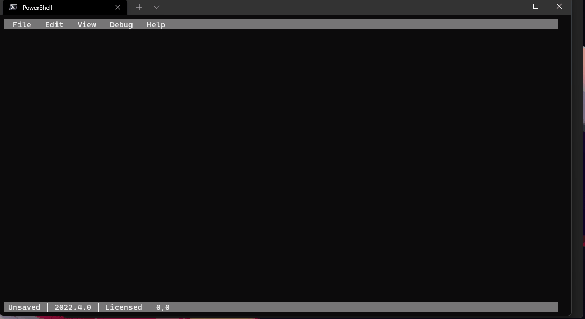

# Show-PSEditor

`Show-PSEditor` displays a terminal-based PowerShell editor that contains the following features.&#x20;

* IntelliSense
* Syntax Highlighting&#x20;
* Execution
* Syntax Error Tagging&#x20;
* File Save and Open&#x20;



## Editing

To start the editor, you can simply call `Show-PSEditor` in a terminal.&#x20;

```powershell
Show-PSEditor
```

You can open a file by using the `-Path` parameter.&#x20;

```powershell
Show-PSEditor -Path .\file.path
```

### Syntax Errors

Syntax errors will be shown in the editor by a red highlight. To view the text of the syntax error, click View \ Syntax Errors.&#x20;

### Formatting

You can format your code in the editor if you have `PSScriptAnalyzer` installed. To format a script, either press `Ctrl+Shift+R` or click Edit \ Format. If you don't have `PSScriptAnalyzer` installed, you can do so with the command below.&#x20;

```powershell
Install-Module PSScriptAnalyzer
```

## Execution

To execute your script, press `F5` to run the entire script. If you want to execute a select, you can press `F8`. You can also execute the script in the terminal and exit the editor by pressing `Ctrl+Shift+F5`.&#x20;

You can also use the Debug menu to access these options.&#x20;

### Errors

Errors generated when running scripts will be shown in the error window. You can access it by clicking View \ Errors.
