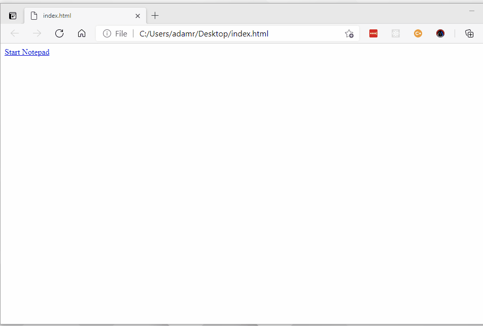

# Custom Protocol Handlers

A custom protocol handler can cause a PSCommander action to be taken from a website or other invocation of the custom protocol.

To define a custom protocol, use `New-CommanderCustomProtocol`. The `$args[0]` parameter contains the URL that was clicked.

```powershell
New-CommanderCustomProtocol -Protocol myApp -Action {
     if ($args[0] -eq 'notepad') { Start-Process notepad }
     if ($args[0] -eq 'calc') { Start-Process calc }
     if ($args[0] -eq 'wordpad') { Start-Process wordpad }
}
```

To use the custom protocol, include regular links in websites. The links invoke PSCommander remotely.

```html
<html>
  <body>
    <a href="myApp://notepad">Start Notepad</a>
  </body>
</html>
```


