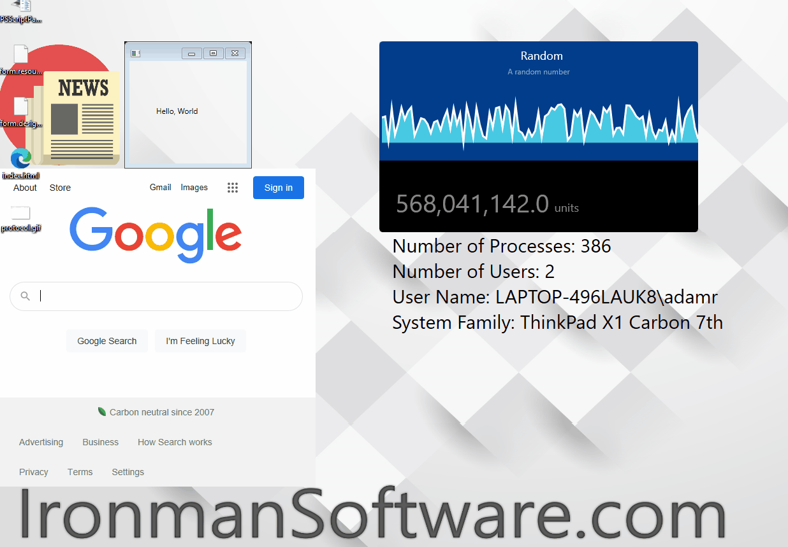

# Desktop Widgets

PSCommander provides a desktop widget system that allows you to place text, images, web pages, custom WPF windows and measurement counters on the desktop. It is a similar experience to SysInternals bginfo and Rainmeter.

All widgets are created using the `New-CommanderDesktopWidget` cmdlet in combination with the `New-CommanderDesktop` or `Set-CommanderDesktop` cmdlets.

## Widget Types

* [Text Widget](text-widget.md)
* [Image Widget](image-widget.md)
* [Webpage Widget](webpage-widget.md)
* [Custom WPF Widget](custom-wpf-widget.md)
* [Measurement Widget](measurement-widget.md)
