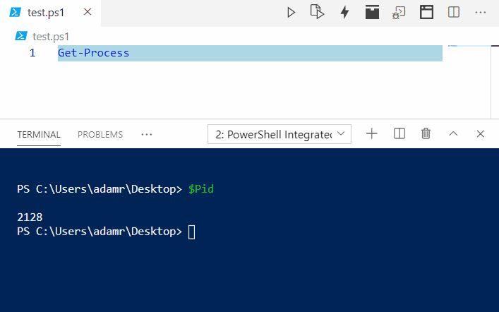

# Start in New Terminal


This feature is coming in a future version of PowerShell Pro Tools.


When working with PowerShell scripts, you may want to run the current script in a new terminal rather than the existing PowerShell session. You can do so by clicking the Start in New Terminal button. This will execute the PowerShell script in a new PowerShell process and open the terminal in Visual Studio Code. You can also use the default key binding `Shift+F5` to start scripts in a new terminal. 

