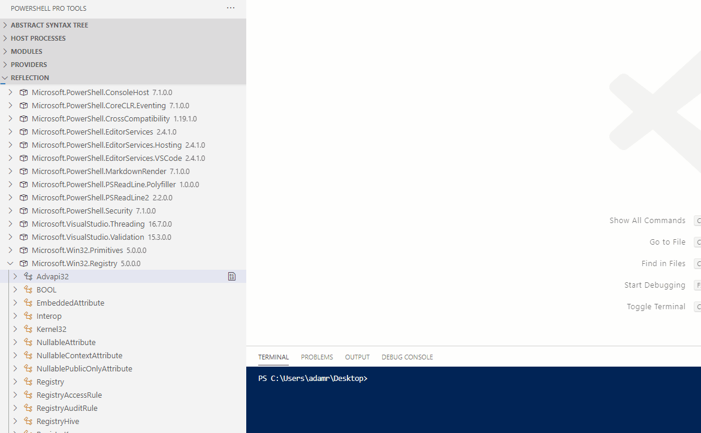

# Decompiler

The decompiler allows you to view the source code for C\# types that are loaded within your PowerShell process. This can be helpful to understand how types and cmdlets work. 

You can access the decompiler by using the Reflection section of the PowerShell explorer. Navigate to a type and click the Decompile Type button. A text editor will open with the decompiled source code. 

