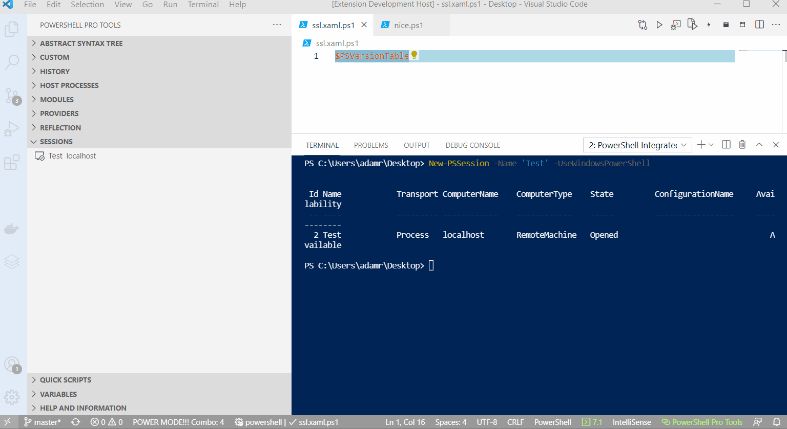

# Pin Session

Using the `Pin Session` command you can pin a particular document to a particular session. Any time you switch to that document, that session will be used.

To pin a session to a document, open the document you wish to pin and press `Ctrl+Shift+P` and search for Pin Session. A list of sessions will be displayed. Select the session to pin. Any time you switch to that tab, that session will be used. You can unpin a session with `Unpin Session`. 

