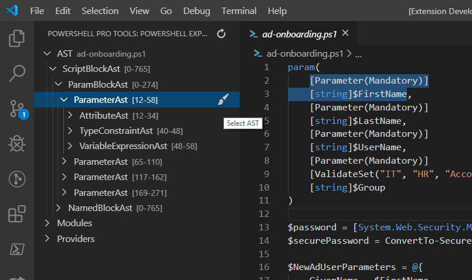
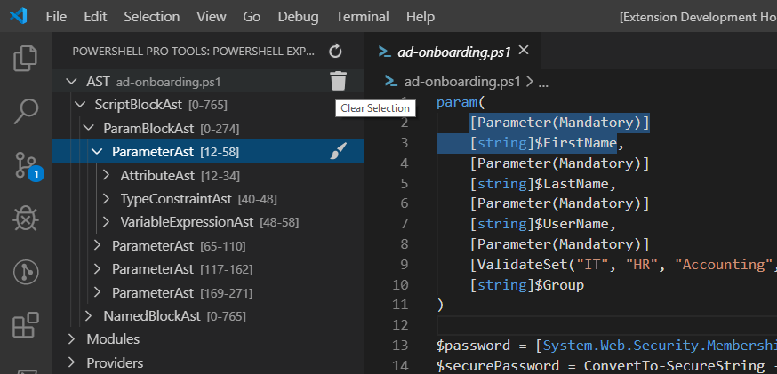
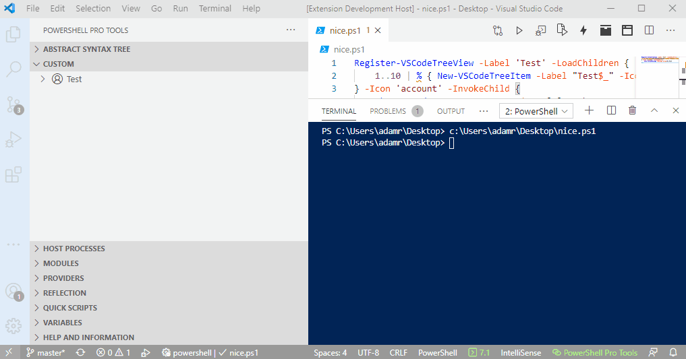
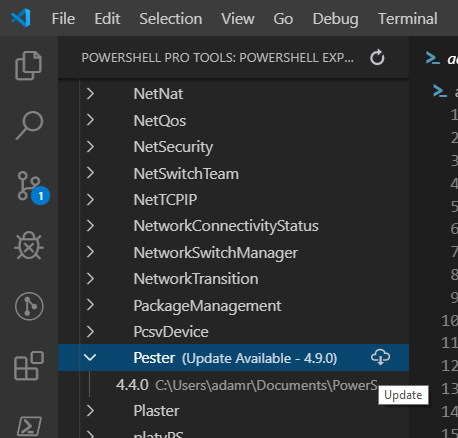
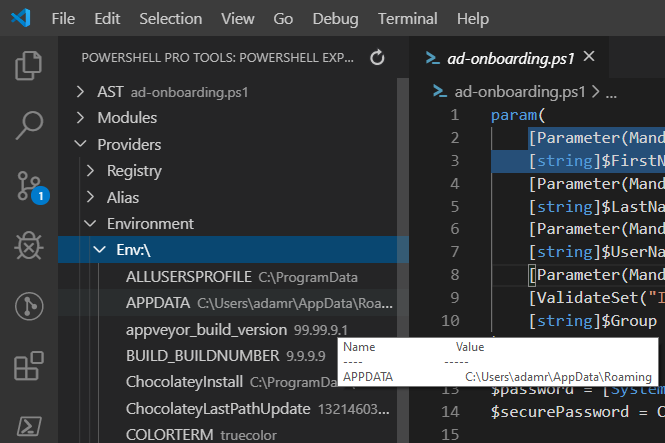
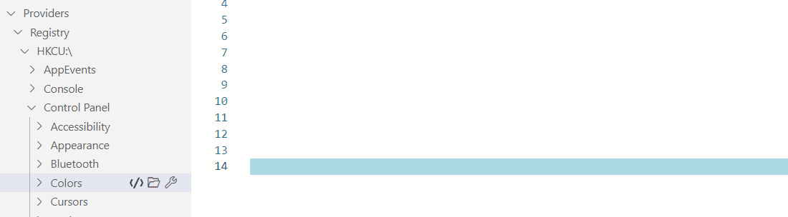
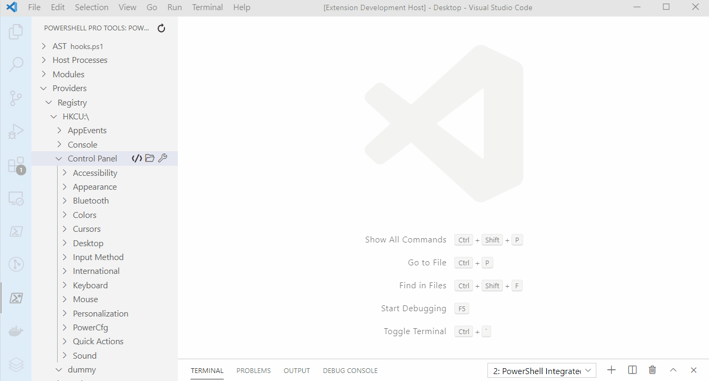
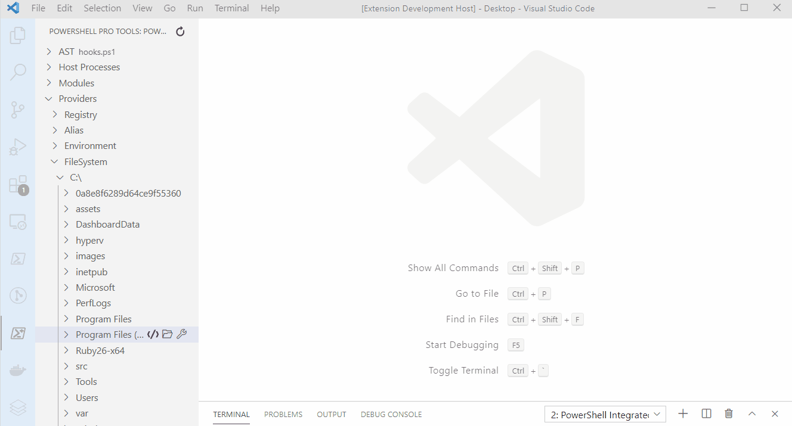
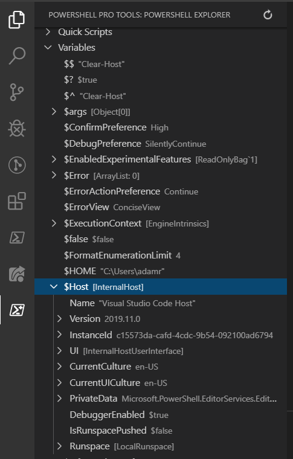

# PowerShell Explorer

The PowerShell Explorer allows you to view the AST, Modules and Providers in your PowerShell Environment.


## AST Explorer

You can explore the AST of the current PowerShell file by using the AST node in the PowerShell Explorer. Open a PS1 or PSM1 file and click the refresh button. The AST node will show which file the AST is currently showing. You can then click the nodes within the AST. Click the Select AST button to highlight the text in the editor that relates to that AST node. 



If you want to clear the AST node selection, click the Clear Selection button. 



## Custom Tree View

The custom tree view allows you to define your own tree views with custom items. Items can have children and support invocation which can call any cmdlet you'd like. You can also integrate with the [VS Code cmdlets](automating-visual-studio-code.md).

The following example creates a tree view named test that creates nested tree items. When each item is clicked, it will display a VS Code message. 

```text
Register-VSCodeTreeView -Label 'Test' -LoadChildren {
    1..10 | % { New-VSCodeTreeItem -Label "Test$_" -Icon 'archive' -HasChildren } 
} -Icon 'account' -InvokeChild {
    Show-VSCodeMessage -Message $args[0].Path
}
```



This example creates a tree view of GitHub repositories and opens then when clicked.

```text
Register-VSCodeTreeView -Label 'GitHub' -LoadChildren {
    New-VSCodeTreeItem -Label 'PowerShell Universal' -Description 'https://github.com/ironmansoftware/powershell-universal' -Icon 'github-inverted'
    New-VSCodeTreeItem -Label 'Issues' -Description 'https://github.com/ironmansoftware/issues' -Icon 'github-inverted'
    New-VSCodeTreeItem -Label 'PowerShell' -Description 'https://github.com/powershell/powershell' -Icon 'github-inverted'
} -Icon 'github' -InvokeChild {
    Start-Process $args[0].Description
}
```

## Host Process Explorer

The host process explorer lets you view processes running PowerShell on your machine. You can click the Attach button to use the [One-Click Attach](debugging/one-click-attach.md) feature. 


## History Explorer 

View the history from PSReadline and insert it into the PowerShell Integrated terminal


## Modules Explorer

The Module Explorer node provides the ability to view modules within your PowerShell environment. It will list all the modules and their versions directly in the tree view. If there is an updated version of a module, the update icon will be available and a description on the node will state the updated version that is available on the gallery. You can click the update button to update that module. 



## Provider Explorer

You can use the PowerShell Provider Explorer in the PowerShell Explorer window to traverse providers in your environment. 



### Insert Selected Item Paths into Scripts

You can insert selected item paths into scripts using the Insert Path command.



### View Item Properties

You can view the properties of a container or item by using the View Item Properties command. 



### View Child Items

You can view child items in a grid by using the View Items command on containers. 



## Reflection Explorer

The reflection explorer allows you to view assemblies, types, and members of those types within the side panel. 


## Variable Explorer

The Variable Explorer allows you to see variables defined in your session without being in the debugger. You can expand and view their properties. Clicking the refresh button will refresh the variable list. 



### Insert Variables into Scripts

You can insert selected variables into scripts using the Insert Variable button. 


Selecting nested properties will insert the path to the property into the script.


