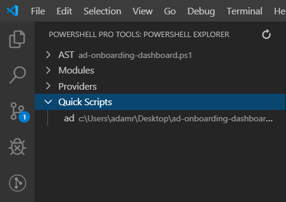
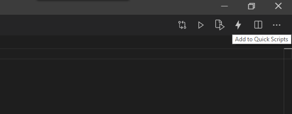
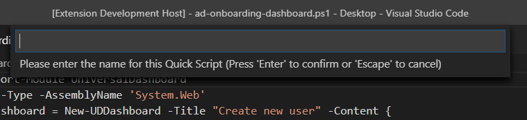

# Quick Scripts

Quick Scripts allow you to save and quickly access scripts that are stored anywhere on your machine. The scripts are stored across workspaces so whenever you open VS Code, you'll have access to the scripts. Quick scripts are listed in the PowerShell Explorer window. 

## Adding Quick Scripts

Quick Scripts can be added by issuing the Add Quick Script command or clicking the Add Quick Script button in the editor. In either case, it will add the current file to Quick Scripts.

After issuing the command or clicking the button, you will have to enter a short name for the Quick Script.

## Opening Quick Scripts

You can either open a Quick Script by click the button in the PowerShell Explorer window or by issuing the Open Quick Script command. When issuing the command, you'll have to enter the name of the Quick Script. 

## Removing Quick Scripts

You can remove quick scripts by clicking the Trash icon in the PowerShell Explorer window. 

