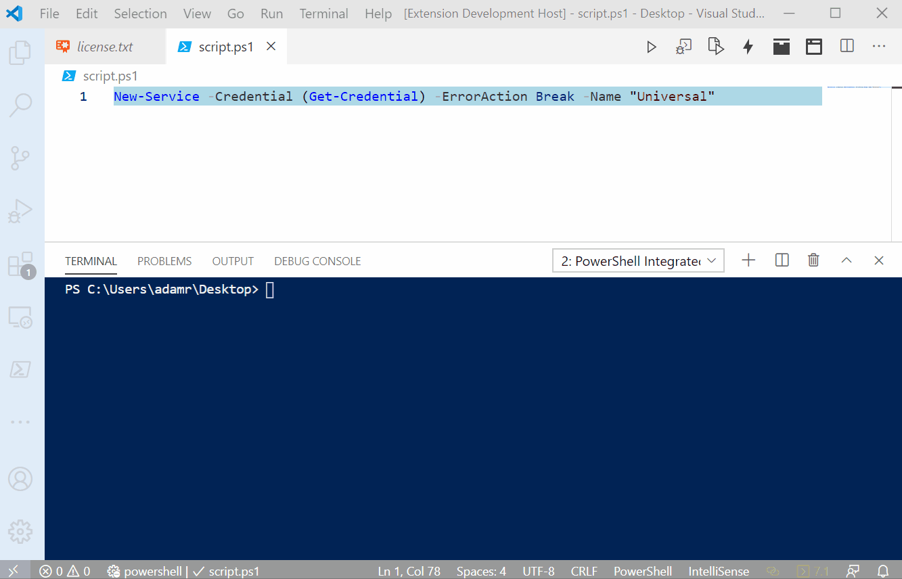
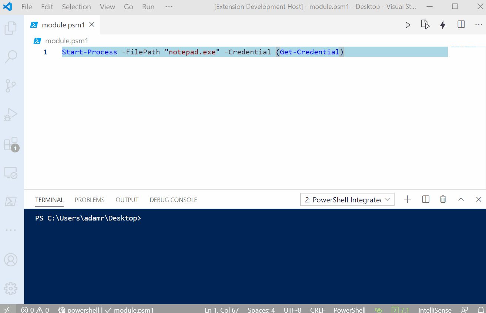
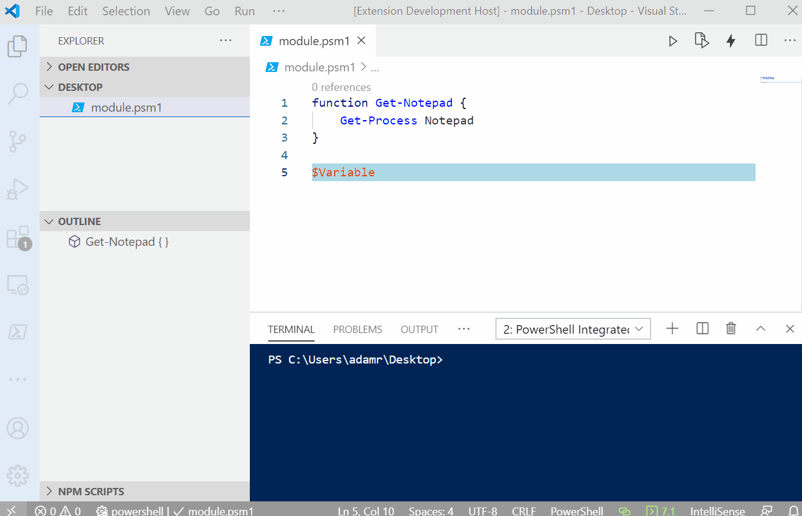
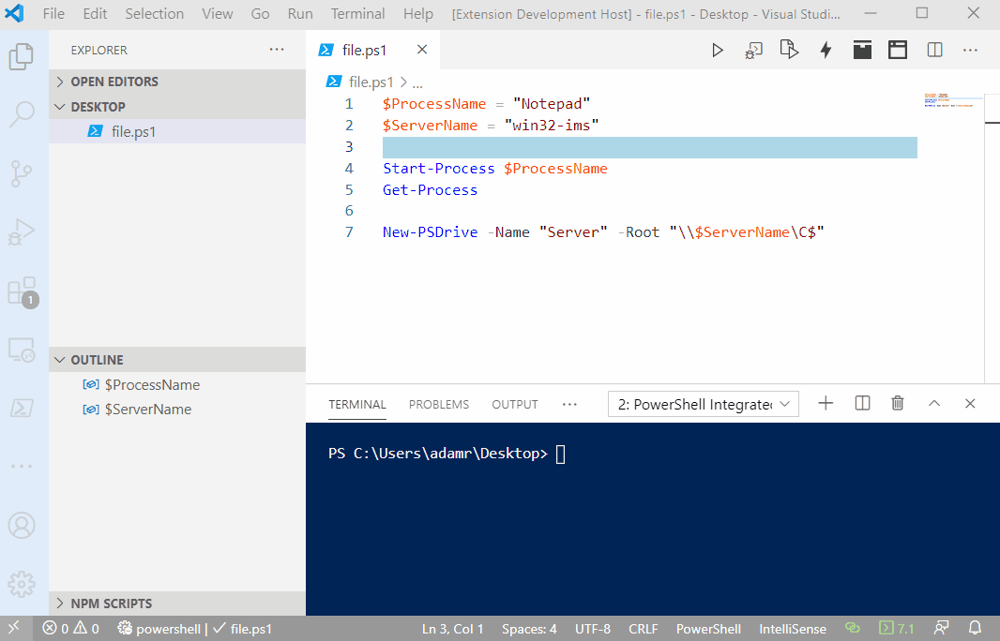
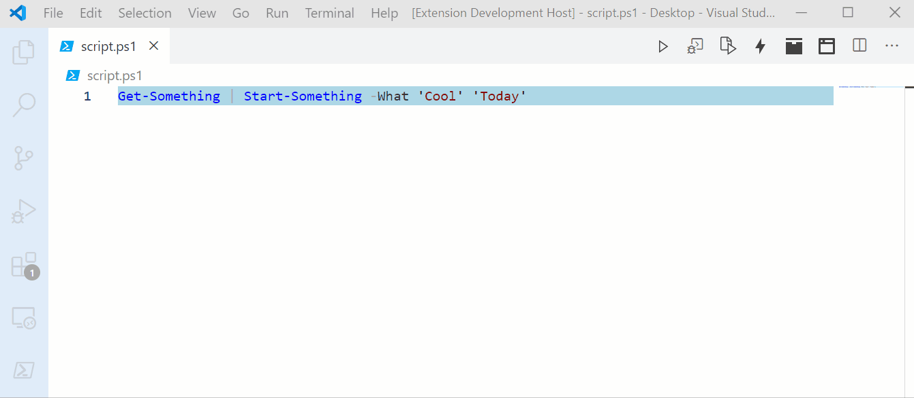
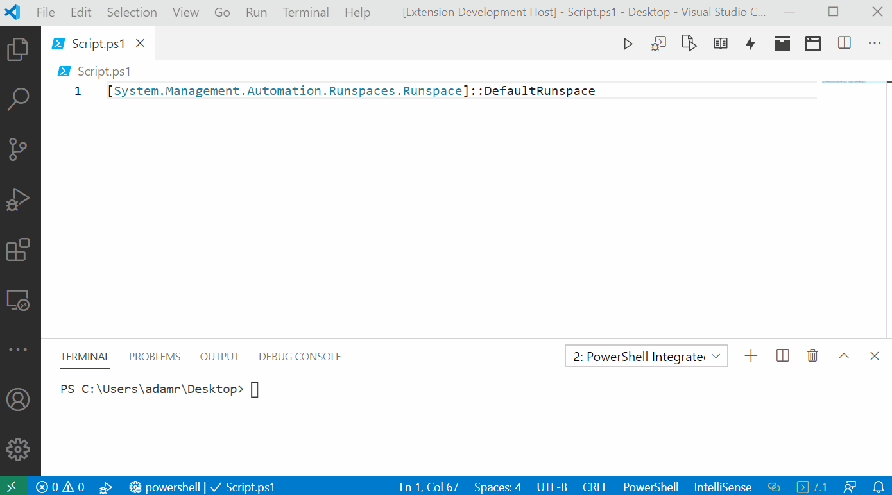
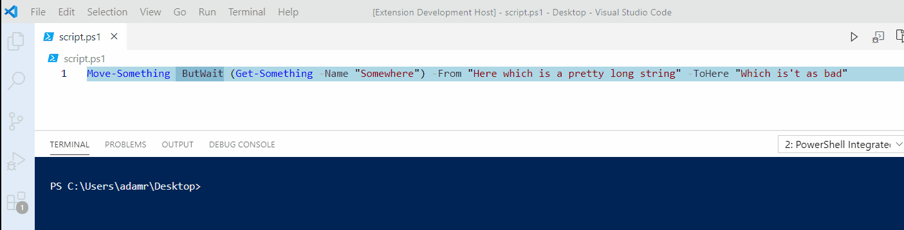
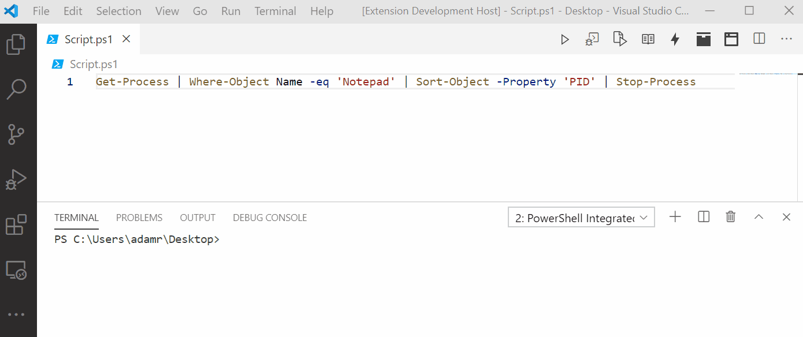

# Refactoring

## About

Refactorings allow you to change or generate code based on the code you have. You will find a list of refactors below. You can invoke a refactor by invoke the Refactor command or by pressing the key binding `Ctrl+Alt+R` . 

Only valid refactors will be returned in the drop down menu.

## Convert to Multiline Command

Converts a command invocation into a multi-line command. Each parameter and argument is broken up with backticks. 

## Convert to Splat

Converts a command invocation into a splatting expression and creates a hashtable named `$Parameters` and then passes that hashtable as a splatting expression to the command. Positional arguments are not added to the hashtable.

## Export Module Member

Exports the selected variable or function from a module using `Export-ModuleMember`.

## Extract Function

You can use the Extract Function refactor to convert a section of code into a function. It will analyze the selected block and determine if there are variables that should be added as parameters. These variables will be added to the `param` block. 

## Extract Selection to File

You can use the Extract Selection to File refactor to create a new file based on the selection in the current active editor. 

## Generate Function from Usage

You can generate a function based on a command example. This refactoring will analyze the parameters, arguments and whether the command is used in a pipeline. If used in a pipeline, this refactoring will generate an advanced function. 

## Introduce Using Namespace

The introduce using namespace refactoring adds a `using namespace` statement to the top of a script and replaces the selected type expression with the namespace removed. 

## Reorder Parameters

You can reorder parameters by using the `Ctrl+PageUp` and `Ctrl+PageDown` key bindings. Ensure that your cursor is on top of a parameter for a command. Press one of the key bindings. To move a parameter to the right, use Page Up. To move a parameter to the left, use Page Down. 

## Split Pipeline

The split pipe refactoring will split a pipe into multiple lines. Each element in the pipe is stored in a variable and passed to the next item in the pipe. This can be useful for debugging long or complex pipeline operations.

