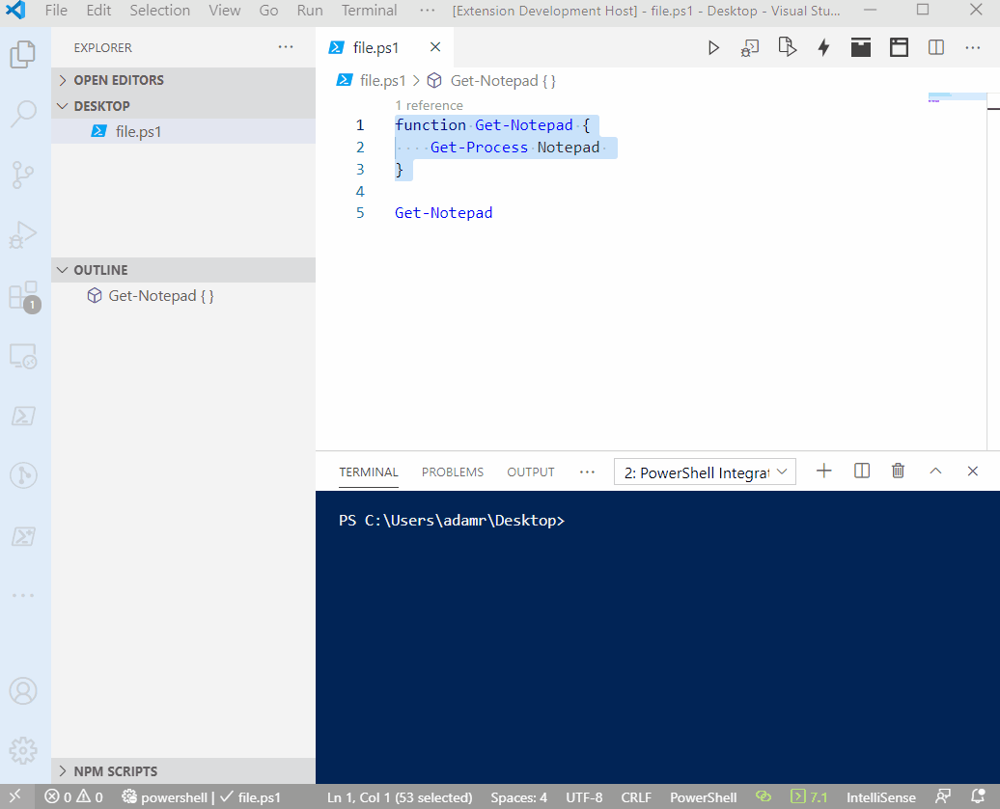

# Refactoring


This functionality is coming in a future version of PowerShell Pro Tools.


## Extract Selection to File

You can use the Extract Selection to File refactoring to create a new file based on the selection in the current active editor. 

