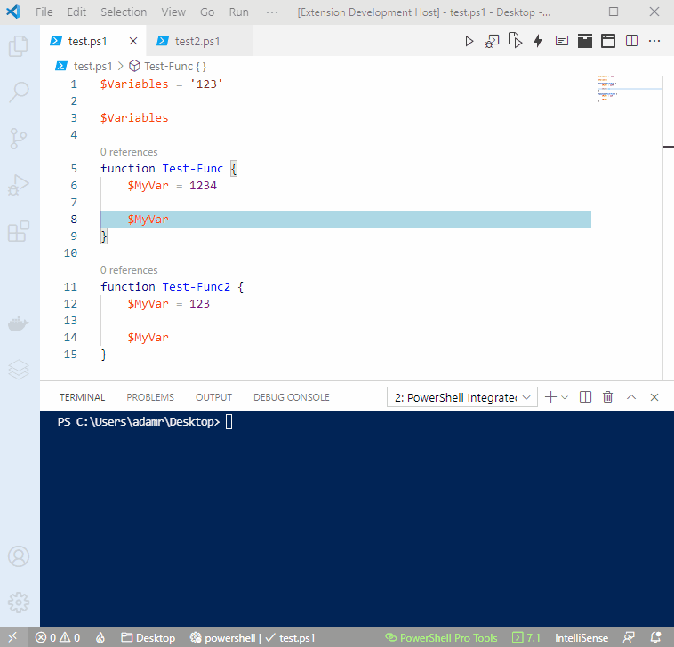
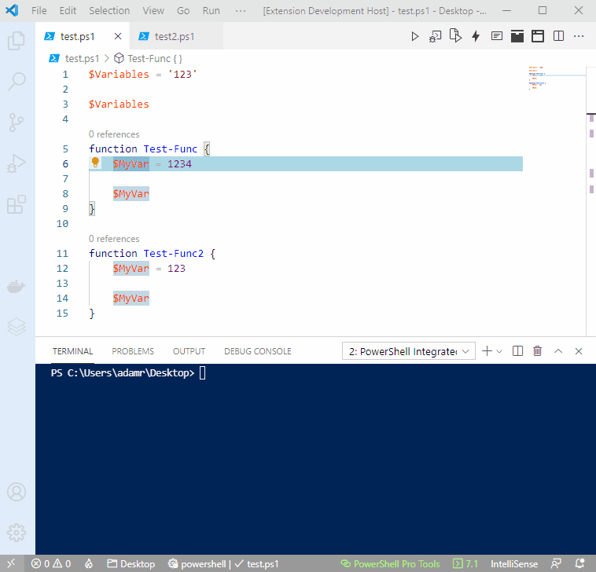

# Rename Symbols

You can press F2 on variables within Visual Studio Code to rename them across the workspace or function you are working in. 

## Variables

### Global Scope

Renaming variables that appear at the top level scope will rename them across the workspace. 

### Function Scope

Function scoped variables will only be renamed within the function you are working with. 

