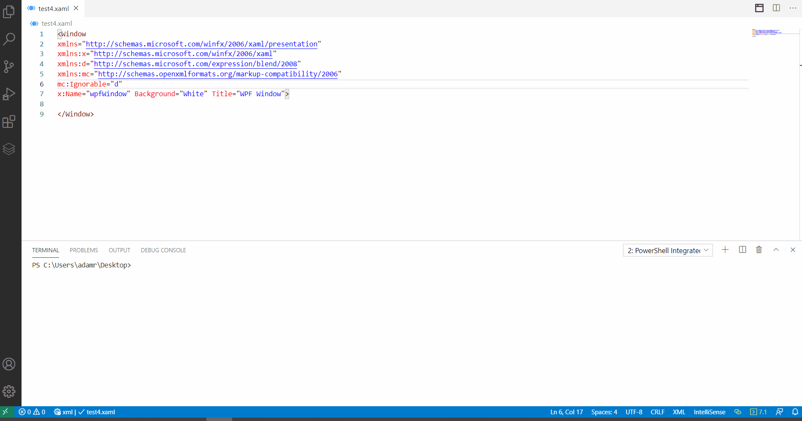

# WPF Designer

You can use the [PSScriptPad WPF Designer](../psscriptpad.md#wpf-designer) from the PowerShell Pro Tools Visual Studio Code extension. It can be opened using the Show Form Designer button found on XAML files.

## Create a new WPF Form

To create a new WPF Form, first create a `.xaml` file in your workspace. Next, put the default Window code found below and save the XAML file.

```text
<Window 
xmlns="http://schemas.microsoft.com/winfx/2006/xaml/presentation"
xmlns:x="http://schemas.microsoft.com/winfx/2006/xaml"
xmlns:d="http://schemas.microsoft.com/expression/blend/2008"
xmlns:mc="http://schemas.openxmlformats.org/markup-compatibility/2006"
mc:Ignorable="d"
x:Name="wpfWindow" Background="White" Title="WPF Window">

</Window>
```

Next, click the Show Form Designer button in the toolbar of the file. PSScriptPad will open the XAML file in the WPF Designer. 



