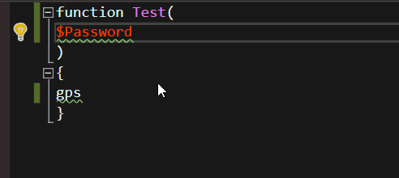

# Analysis

PowerShell Pro Tools uses PSScriptAnalyzer to run static code analysis of PowerShell scripts in Visual Studio. You can enable analysis by click Tools-&gt;Options and navigating to PowerShell Tools. 

On the options page, you can turn on and off script analyzer completely, manage solution wide analysis, disable specific severities or even specific rules. 

When Script Analyzer is enabled, squiggly lines will be present within source files to provide information on potential issues with the ability to provide quick fixes for those issues. 

If you have solution wide analysis enabled, you will be able to see errors within your entire solution within the Error List window. 

## Quick Fix

PowerShell Pro Tools supports quick fix actions provided by PSScriptAnalyzer. If the suggestion has a Suggested Correction, PowerShell Pro Tools will provide a Quick Action light bulb next to the line that needs to be addressed. 

