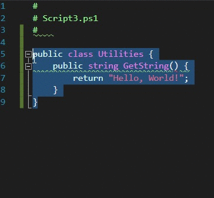

# Code Conversion


Requires a PowerShell Pro Tools license.


## Executing Code Conversion

To execute code conversion, select your C# code in a PS1 file. Right click on the C# code and click Convert to PowerShell. The code will be converted from PowerShell to C#.&#x20;

### Convert C# to PowerShell


Your PS1 file must be a part of a PowerShell Project for this functionality to be visible.


1. Create a .ps1 script file in Visual Studio.
2. Paste the C# code into the PS1 file.
3. Select the C# code within the PS1 file and right click the selection.
4. Click Convert to PowerShell

### Convert PowerShell to C\#

1. Create a .cs file in Visual Studio
2. Paste the PowerShell script into the .cs file
3. Select the PowerShell script within the .cs file and click the selection.
4. Click Convert to C#

## What to Expect

Code conversion is a difficult problem and PowerShell Pro Tools implements a solution to help with the process. Since code conversion is very specific to the syntax of both languages and the style of code, it is often very difficult to support every single scenario. PowerShell Pro Tools takes a “best effort” approach to conversion. Assume that the conversion process may have issues that need manual resolution. That said, we are looking to ever improve the conversion process.&#x20;

**PowerShell to C# Details**

Converting PowerShell to C# syntax is relatively straight forward. There are programming constructs in both languages for conditional statements, functions, variables and .NET types. That said, there are aspects of PowerShell that do not translate one-to-one in C#.

_Cmdlets_

PowerShell cmdlets do not exist in C#. In order to accommodate the conversion, the PowerShell SDK will be wrapped around calls that cannot be translated. For example, if you want to convert a cmdlet like Disable-IisSecurityAuthentication, there is not currently a defined translation for that cmdlet. The resulting C# code would use the PowerShell class and AddCommand methods.

Some cmdlets do have a conversion from PowerShell to C#.&#x20;

_Pipeline_

The pipeline is unique to PowerShell. There are ways to mimic the pipeline in C# but they are currently not implemented.

_Classes_

Although PowerShell now supports classes, converting them to C# is not supported at this time.

_DSC Resources_

Conversion from DSC resources is not supported.

**C# to PowerShell Details**

Just as with PowerShell to C# conversion, C# to PowerShell conversion works well for major syntactical language components.

_Classes_

Conversion will currently only convert the methods into PowerShell functions and not the class definition itself.

_Async\Await_

Conversion has no support for async\await

_Generics_

Conversion has no support for generics.

_P\Invoke_

P\Invoke signatures written in C# can be translated into PowerShell functions.
