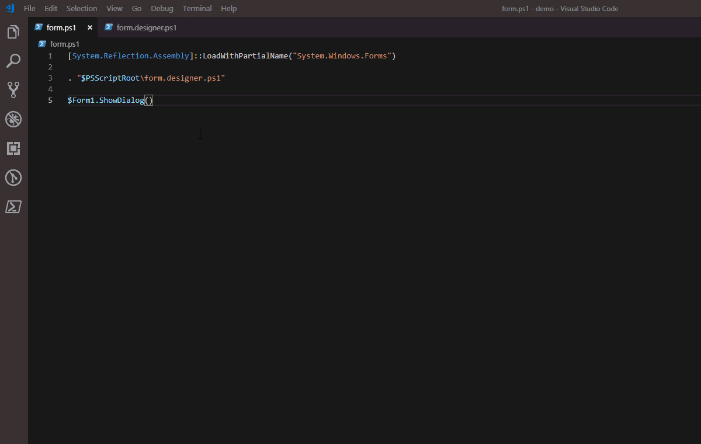

# 0.5.0

## Form Designer Support


This Windows Form designer only works on Windows and with Windows PowerShell.

The designer is currently in beta. Please report any [issues to our tracker](https://poshtools.com/issues).


The PoshProTools VS Code extension now supports a Windows Forms Designer. 


The designer is part of the PoshProTools module included with the VS Code extension. Invoking the `PowerShell: Show Windows Forms Designer` command will open the designer and use the current PS1 file as the root for the script.



 Any changes made in the designer and saved to disk will result in a designer.ps1 file being generated. To add controls, click the control you'd like and then click the designer surface to add it to the form. 


You can hook up event handlers by double-clicking a control. If will insert the correct event handler code into the form.ps1 and then put your cursor at that position in VS Code. 


Some of the basics of starting the form and loading the WinForms DLL are currently not handled by the designer. You'll need to add the following code to your PS1 to ensure you can run the form from VSCode. 

Note that this assumes that your form PS1 is called form.ps1 and your form is named `$Form1`

```text
[System.Reflection.Assembly]::LoadWithPartialName("System.Windows.Forms")
. "$PSScriptRoot\form.designer.ps1"
$Form1.ShowDialog()
```


