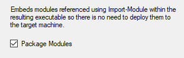
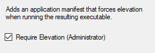

# v1.5.0

[VS2017](https://marketplace.visualstudio.com/items?itemName=AdamRDriscoll.PowerShellProToolsforVisualStudio2017), [VS2015](https://marketplace.visualstudio.com/items?itemName=AdamRDriscoll.PowerShellProToolsforVisualStudio2015),[PowerShell Module](https://www.powershellgallery.com/packages/PowerShellProTools/1.5.0)  

**Released: 5-20-2018** 

## Improved Module Packaging

You can now enable module packaging in the project properties. Modules that you import in the script that you are packaging can be embedded in resulting executable. When running the executable on target machines, there is no need to manually deploy or install these modules. Required and nested modules will also be included. 

## Require Elevation

You can now require elevation of your packaged script so that UAC elevation is required. 

## Executable Details

You can now add file version, description, product name, product version and copyright to your exectuables. 

